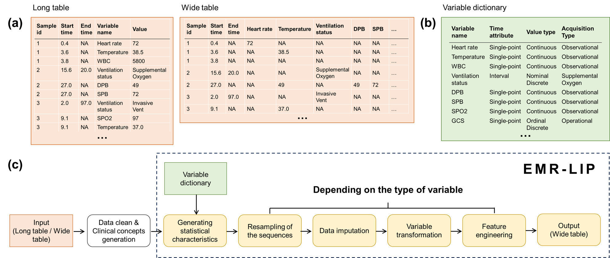

# EMR-LIP


### Introduction to EMR-LIP

The EMR-LIP is a streamlined framework that provides a range of tools applicable across various EMR databases for processing longitudinally irregular data found in EMRs.  It primarily transforms long or wide tables into regular, multivariate time series for ease in downstream task modeling, including the development of fixed-point triggered models, continuous prediction models, or reinforcement learning models.

It should be noted that EMR-LIP excludes specific data cleaning tasks unique to research or databases, such as outlier management, variable consolidation, and clinical concept creation.  These tasks are not readily transferable across different databases through a standardized program.  In contrast, EMR-LIP abstracts the universal aspects of processing longitudinally irregular data and develops flexible tools for these areas to standardize EMR irregular longitudinal data preprocessing and enhance the comparability of downstream tasks.

What sets EMR-LIP apart from other frameworks is its more detailed variable classification.  Preprocessing of longitudinally irregular data often involves sequence resampling, imputation, and variable transformation, with distinct processing details needed for different variable types.  Previous frameworks mainly focused on the value type of variables, categorizing them as continuous or discrete, an approach insufficient for correctly processing all types of variables with longitudinally irregular sampling in EMR-LIP.

EMR-LIP categorizes EMR variables into three dimensions: <u>**temporal attributes, value types, and acquisition methods**</u>.  Temporally, variables are classified as static, single-point, or interval-based.  In terms of value types, they are divided into numerical, ordinal discrete, nominal discrete, and binary.  From the acquisition perspective, variables are identified as observational or operational.  A detailed breakdown of these variable types is presented in **Table 1**. 

### Table 1. Classification of variables in EMR databases.

<div style="height:300px; width:700px; overflow:scroll;">

<table>
    <tr>
        <th>Classification</th>
        <th>Type</th>
        <th>Description</th>
        <th>Example Variable</th>
    </tr>
    <tr>
        <td rowspan="3">By time attribute</td>
        <td>Static</td>
        <td>Without temporal attributes</td>
        <td>Gender</td>
    </tr>
    <tr>
        <td>Single-point</td>
        <td>Contains only a single time information</td>
        <td>Temperature</td>
    </tr>
    <tr>
        <td>Interval</td>
        <td>Contains a start and end time</td>
        <td>Ventilation status</td>
    </tr>
    <tr>
        <td rowspan="4">By value type</td>
        <td>Continuous</td>
        <td>Can take continuous values</td>
        <td>Temperature</td>
    </tr>
    <tr>
        <td>Ordinal discrete</td>
        <td>Discrete values with an inherent order</td>
        <td>GCS (Glasgow Coma Scale) score</td>
    </tr>
    <tr>
        <td>Nominal discrete</td>
        <td>Discrete values without any inherent order</td>
        <td>Ventilation status</td>
    </tr>
    <tr>
        <td>Binary</td>
        <td>Has two distinct outcomes, typically representing presence or absence</td>
        <td>Ventilation (yes/no)</td>
    </tr>
    <tr>
        <td rowspan="2">By acquisition type</td>
        <td>Observational</td>
        <td>Data naturally recorded or collected without any human intervention</td>
        <td>Gender, Temperature</td>
    </tr>
    <tr>
        <td>Operational</td>
        <td>Derived from a specific operation or action</td>
        <td>Ventilation status</td>
    </tr>
</table>

</div>

<br>
<br>

### Illustration of the EMR-LIP Framework

For detailed use cases and introduction, please refer to the [**demo_EMR-LIP.ipynb**](./demo_EMR-LIP.ipynb) file.

<br>
<br>



<br>
<br>

The EMR-LIP framework is composed of eight distinct parts: <u>**1.input, 2.data cleaning and clinical concept generation, 3.variable dictionary and statistical information generation, 4.sequence resampling, 5.data imputation, 6.variable transformation, 7.feature engineering, and 8.the final output.**</u> 

#### To be first, load EMR-LIP framework

```r
source("./EMR_APIs.R")
```

#### **1. Input**

Long table or wide table

#### **2. Data cleaning and clinical concept generation**

EMR-LIP does not provide tools for data cleaning and clinical concept generation.

#### **3. Variable dictionary and statistical information generation**

#### Variable dictionary

<div style="height:200px; width:700px; overflow:scroll;">

<table>
    <tr>
        <th>itemid</th>
        <th>time_attribute</th>
        <th>value_type</th>
        <th>acqu_type</th>
        <th>agg_f</th>
    </tr>
    <tr>
        <td>age</td>
        <td>static</td>
        <td>num</td>
        <td>obs</td>
        <td>NA</td>
    </tr>
    <tr>
        <td>K</td>
        <td>single</td>
        <td>num</td>
        <td>obs</td>
        <td>median</td>
    </tr>
    <tr>
        <td>urine</td>
        <td>single</td>
        <td>num</td>
        <td>oper</td>
        <td>sum</td>
    </tr>
    <tr>
        <td>ventilation_status</td>
        <td>interval</td>
        <td>cat</td>
        <td>oper</td>
        <td>last</td>
    </tr>
    <tr>
        <td>vasopressin</td>
        <td>interval</td>
        <td>num</td>
        <td>oper</td>
        <td>sum_w</td>
    </tr>
    <tr>
        <td>...</td>
        <td>...</td>
        <td>...</td>
        <td>...</td>
        <td>...</td>
    </tr>
</table>

</div>

#### Statistical information generation

<div style="height:300px; width:700px; overflow:scroll;">

```r
# remove static variable
dict <- dict[dict$time_attribute != "static",]

# for long table input
stat <- get_stat_long(ds,  # dataframe
                      dict$itemid, # itemid vector
                      dict$value_type,  # value_type vector
                      itemcol,  # int, itemid column index
                      valuecol # int, value column index
                      )

# for wide table input
stat <- get_stat_long(ds, # dataframe
                      dict$itemid, # itemid vector
                      dict$value_type # value_type vector
                      )
```
</div>

#### **4. Sequence resampling**

<div style="height:300px; width:700px; overflow:scroll;">

```r

# for single time point variable

# resample the long table
ds_k1 <- resample_data_long(ds_k, # dataframe,  long table that needs resampling
                            dict$itemid, # itemid vector
                            dict$value_type,  # value_type vector
                            dict$agg_f, # character vector, aggregation method list of variables
                            time_range,  # numeric vector, resampling time list
                            "itemid",  # the column name for variable names in the long table
                            "value",  # the column name for variable value in the long table
                            "timecol_1",  # the column name for relative start times in the long table
                            "timecol_2",  # the column name for relative end times in the long table
                            1 # time interval/time window
                            )

# resample the wide table
ds_k1 <- resample_data_wide(ds_k, # dataframe,  wide table that needs resampling
                            dict$itemid, # itemid vector
                            dict$value_type,  # value_type vector
                            dict$agg_f, # character vector, aggregation method list of variables
                            time_range,  # numeric vector, resampling time list
                            "timecol_1",  # the column name for relative start times in the long table
                            "timecol_2",  # the column name for relative end times in the long table
                            1 # time interval/time window
                            )

# for interval-type variable

# resample the long table
ds_k1 <- resample_process_long(ds_k, # dataframe,  long table that needs resampling
                                dict$itemid, # itemid vector
                                dict$value_type,  # value_type vector
                                dict$agg_f, # character vector, aggregation method list of variables
                                time_range,  # numeric vector, resampling time list
                                "itemid",  # the column name for variable names in the long table
                                "value",  # the column name for variable value in the long table
                                "timecol_1",  # the column name for relative start times in the long table
                                "timecol_2",  # the column name for relative end times in the long table
                                1 # time interval/time window
                                )

# resample the wide table
ds_k1 <- resample_process_wide(ds_k, # dataframe, wide table that needs resampling
                                dict$itemid, # itemid vector
                                dict$value_type,  # value_type vector
                                dict$agg_f, # character vector, aggregation method list of variables
                                time_range,  # numeric vector, resampling time list
                                "timecol_1",  # the column name for relative start times in the long table
                                "timecol_2",  # the column name for relative end times in the long table
                                1 # time interval/time window
                                )
```

</div>

#### **5. Data imputation**

<div style="height:300px; width:700px; overflow:scroll;">

```r
dict <- get_fill_method(dict)

ds_k2 <- fill(ds_k1,  # matrix, wide table to fill
                3:ncol(ds_vital_k1),  # The index of the column to be filled
                1,  # Index of the time column
                dict$value_type,  # value type list
                dict$fill,  # fill method list
                dict$fillall, # fillall method list 
                stat # List of statistics (this was previously generated using the get_stat_* function)
                )
```

</div>

#### **6. Variable transformation**

<div style="height:300px; width:700px; overflow:scroll;">

```r
# normalization
ds_k2 <- norm_num(ds_k2,  # matrix, wide table that needs to be normalized
                2:ncol(ds_k2), # Index of the column that needs to be processed
                1, # Index of the time column
                dict$value_type,  # value type list
                stat # List of statistics (this was previously generated using the get_stat_* function)
                )

# one-hot encoding
ds_k2 <- to_onehot(ds_k2, # matrix, wide table that requires one_hot transformation
                2:ncol(ds_k2), # Index of the column that needs to be processed
                1, # Index of the time column
                dict$value_type,  # value type list
                stat # List of statistics (this was previously generated using the get_stat_* function)
                )
```
</div>

#### **7. Feature engineer**

<div style="height:300px; width:700px; overflow:scroll;">

```r
# generate missing mask

mask_k1 <- get_mask(ds_k1, # matrix, wide table before data imputation
                    3:ncol(ds_k1), # column indexs needing to generate missing indicator
                    1 # time column index
                    )
mask_k1 <- shape_as_onehot(mask_k1, 2:ncol(mask_k1), 1, get_type(stat), stat)

# generate delta time matrix
delta_k1 <- get_deltamat(mask_k1, # matrix, missing mask
                        2:ncol(mask_k1), , # column indexs needing to generate delta time
                        1)
```

</div>

#### **8. Output**

<div style="height:300px; width:700px; overflow:scroll;">

```r
# convert all columns to numerical type and transform into a dataframe.

ds_k2 <- as.data.frame(ds_k2) %>% lapply(., as.numeric) %>% as.data.frame

mask_k1 <- as.data.frame(mask_k1) %>% lapply(., as.numeric) %>% as.data.frame

delta_k1 <- as.data.frame(delta_k1) %>% lapply(., as.numeric) %>% as.data.frame
```

<div>
