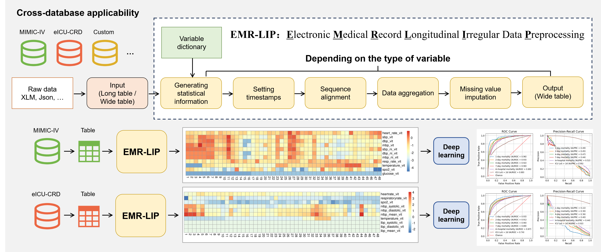

# EMR-LIP 框架介绍

## 概述
EMR-LIP（Electronic Medical Record Longitudinal Irregular Data Preprocessing）框架是为了规范电子病历（EMR）中纵向不规则数据（LID）的预处理而设计的。该框架详细划分了变量类型，并为所有类型的变量提供了值聚合和缺失值填补方法的指南。据我们所知，EMR-LIP是首个综合考虑现有研究并对LID预处理进行规范化的框架。我们在多个具有LID的公开EMR数据库中展示了如何利用EMR-LIP进行LID预处理，为未来研究中的LID预处理建立了参考标准。




## EMR-LIP框架用法

### 数据预处理
EMR-LIP框架提供了一系列函数来处理EMR数据，包括数据读取、变量重命名、异常值移除、数据聚合和缺失值处理等。以下是`demo.R`中使用EMR-LIP框架的一些关键步骤：

1. **数据读取**：
   使用`read_excel`函数从Excel文件中读取数据和变量字典。
   ```R
   ds <- read_excel("data.xlsx", col_names=T, sheet=1)
   var_dict <- read_excel("var_dict.xlsx", col_names=T, sheet=1)
   ```

2. **变量分类**：
   根据时间类型将变量字典分为单次测量和时间间隔测量两部分。
   ```R
   var_dict1 <- var_dict[var_dict$time_type == "single", ,drop=F]
   var_dict2 <- var_dict[var_dict$time_type == "interval", ,drop=F]
   ```

3. **数据映射**：
   使用`rename_long_table`函数根据变量映射字典重命名数据集中的变量名。
   ```R
   ds <- rename_long_table(ds, ds_map$old_name, ds_map$new_name, "item_id")
   ```

4. **异常值处理**：
   使用`remove_extreme_value_long`函数根据变量字典中的上下限移除异常值。
   ```R
   ds <- remove_extreme_value_long(ds, var_dict$itemid, var_dict$value_type, "item_id", "value", var_dict)
   ```

5. **数据聚合**：
   根据变量的聚合函数进行数据聚合，如平均值、求和等。
   ```R
   stat_ds1 <- get_stat_long(ds, var_dict1$itemid, var_dict1$value_type, "item_id", "value", var_dict1$cont)
   ```

6. **缺失值填补**：
   使用`fill`函数根据指定的填补方法填补缺失值。
   ```R
   ds_k1 <- fill(ds_k1, 2:ncol(ds_k1), 1, get_type(stat_ds1), var_dict1$fill1, var_dict1$fill2, stat_ds1)
   ```

### 示例
以上步骤展示了如何使用EMR-LIP框架进行数据预处理。具体的函数和参数设置需要根据实际数据和研究需求进行调整。更多的内容可以参考`EMR_LIP_demo.ipynb` 文件.

## 结论
EMR-LIP框架为处理电子病历中的纵向不规则数据提供了一套完整的解决方案，通过规范化的预处理步骤，可以有效地提高数据质量和研究的可靠性。

<br><br><br><br><br>

# Introduction to the EMR-LIP Framework

## Overview
The EMR-LIP (Electronic Medical Record Longitudinal Irregular Data Preprocessing) framework is designed to standardize the preprocessing of longitudinal irregular data (LID) in electronic medical records (EMR). This framework meticulously categorizes variable types and provides guidelines for value aggregation and missing data imputation for all types. To our knowledge, EMR-LIP is the first framework to comprehensively consider existing research and standardize the preprocessing of LID. We demonstrate how to utilize the EMR-LIP in multiple public EMR databases with LID, establishing a reference standard for future research in LID preprocessing.

## Usage of the EMR-LIP Framework

### Data Preprocessing
The EMR-LIP framework offers a suite of functions for processing EMR data, including data reading, variable renaming, outlier removal, data aggregation, and missing value handling. Below are some key steps in using the EMR-LIP framework within `demo.R`:

1. **Data Reading**:
   Use the `read_excel` function to read data and variable dictionaries from Excel files.
   ```R
   ds <- read_excel("data.xlsx", col_names=T, sheet=1)
   var_dict <- read_excel("var_dict.xlsx", col_names=T, sheet=1)
   ```

2. **Variable Classification**:
   Divide the variable dictionary into single measurement and time interval measurement categories based on time type.
   ```R
   var_dict1 <- var_dict[var_dict$time_type == "single", ,drop=F]
   var_dict2 <- var_dict[var_dict$time_type == "interval", ,drop=F]
   ```

3. **Data Mapping**:
   Use the `rename_long_table` function to rename variables in the dataset according to the variable mapping dictionary.
   ```R
   ds <- rename_long_table(ds, ds_map$old_name, ds_map$new_name, "item_id")
   ```

4. **Outlier Handling**:
   Use the `remove_extreme_value_long` function to remove outliers based on the upper and lower limits in the variable dictionary.
   ```R
   ds <- remove_extreme_value_long(ds, var_dict$itemid, var_dict$value_type, "item_id", "value", var_dict)
   ```

5. **Data Aggregation**:
   Aggregate data according to the variable's aggregation function, such as average, sum, etc.
   ```R
   stat_ds1 <- get_stat_long(ds, var_dict1$itemid, var_dict1$value_type, "item_id", "value", var_dict1$cont)
   ```

6. **Missing Value Imputation**:
   Use the `fill` function to impute missing values according to the specified imputation method.
   ```R
   ds_k1 <- fill(ds_k1, 2:ncol(ds_k1), 1, get_type(stat_ds1), var_dict1$fill1, var_dict1$fill2, stat_ds1)
   ```

### Example
The above steps illustrate how to use the EMR-LIP framework for data preprocessing. Specific functions and parameter settings should be adjusted based on actual data and research needs. For more details, refer to the `EMR_LIP_demo.ipynb` file.

## Conclusion
The EMR-LIP framework provides a comprehensive solution for processing longitudinal irregular data in electronic medical records. Through standardized preprocessing steps, it effectively enhances data quality and the reliability of research.